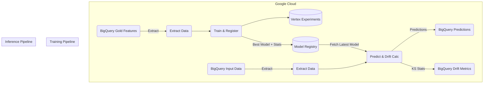

# Anchoveta MLOps Pipelines

This repository contains the Vertex AI Pipelines for the Anchoveta Density Prediction model.

## Architecture

We use a single, unified Docker image for both the training and inference pipelines. This minimizes operational overhead, avoids dependency drift between pipeline components, and ensures feature engineering logic is identical in both environments.



## Setup

1. **Environment Variables**: Copy `.env` to match your GCP project configuration.
    ```bash
    GCP_PROJECT=your-gcp-project-id
    REGION=us-central1
    GCS_PIPELINE_ROOT=gs://your-bucket/pipelines
    BQ_TRAIN_TABLE=anchoveta.gold.gold_features
    BQ_INFER_TABLE=anchoveta.gold.gold_features_infer
    BQ_PRED_TABLE=anchoveta.gold.predictions
    BQ_DRIFT_TABLE=anchoveta.gold.drift_metrics
    MODEL_DISPLAY_NAME=anchoveta_densidad_model
    EXPERIMENT_NAME=anchoveta-training
    DOCKER_IMAGE_URI=us-central1-docker.pkg.dev/your-gcp-project-id/mlops-repo/anchoveta-pipeline:latest
    ```

2. **Docker Image**: Build and push the unified image.
    ```bash
    docker build -t $DOCKER_IMAGE_URI .
    docker push $DOCKER_IMAGE_URI
    ```

3. **Python Environment**: Install dependencies to compile pipelines locally.
    ```bash
    uv venv
    source .venv/bin/activate
    uv pip install -r requirements.txt
    ```

## Execution

Compile and run the training pipeline:
```bash
python src/pipelines/train_pipeline.py
python scripts/submit_train.py
```

Compile and run the inference pipeline:
```bash
python src/pipelines/infer_pipeline.py
python scripts/submit_infer.py
```

## Technical Details

- **Ponytail Architecture**: Instead of over-engineering artifacts, drift statistics (mean/std) are calculated during training and packaged natively alongside the `.joblib` model object inside the Vertex Model Registry directory. The inference pipeline downloads the entire directory, providing instant access to both the model and the training distribution stats.
- **Drift Calculation**: Kolmogorov-Smirnov (KS) statistic is utilized for distribution comparison (training vs inference). Real-time alerting is deferred; metrics are collected in BigQuery (`anchoveta.gold.drift_metrics`) for dashboarding.
- **Walk-forward Validation**: The best model is evaluated natively on time-series splits before final refit.
